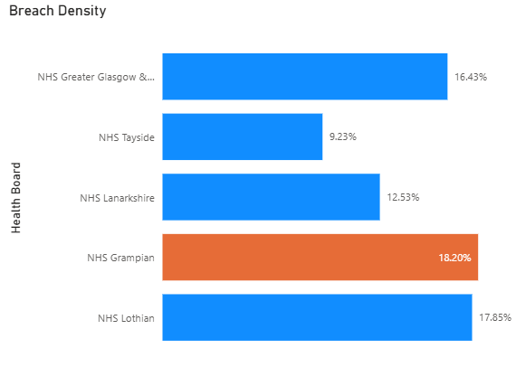
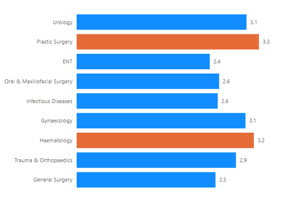

# 🏥 NHS Scotland Elective Care & Breach Trend Analysis

🔗 **[Read the Full Executive Summary & Business Context on LinkedIn](https://www.linkedin.com/pulse/data-vs-delays-engineering-recovery-nhs-scotlands-elective-osimosu-ljgde/)**

## 📌 Business Problem
Following systemic disruptions to healthcare services, NHS Scotland faced a massive backlog in elective care. The raw clinical data provided by Public Health Scotland was difficult to analyze due to legacy identifiers, inconsistent schemas, and administrative latency. The objective of this project was to move beyond simply counting total waitlists and instead engineer a data model that identifies the specific regions and medical specialties suffering the most severe bottlenecks.

## 🛠️ Tools Used
* **SQL Server (T-SQL):** Data staging, schema hardening, and view creation.
* **Advanced SQL:** Window functions (`LAG`), conditional aggregation, CTEs, and dynamic data casting.
* **SSIS & Excel:** Data ingestion and secondary processing.

## 💡 Key Analytical Outcomes & Visual Insights
By building a defensive engineering pipeline and a robust normalization layer (`vw_Clean_Treatment_Waits`), this analysis extracted actionable diagnostic intelligence:

### 1. Identified Hidden Regional Risk
I modeled a "Breach Density" metric to show that while urban boards have the largest total lists, **NHS Grampian (18.2%)** and **NHS Lothian (17.85%)** have the highest proportion of patients waiting over 52 weeks.

*Figure 1: Percentage of waitlist over 52 weeks by NHS Board.*

### 2. Quantified Clinical Inequality
I calculated disparity metrics showing that complex cases are being left behind. Patients requiring **Plastic Surgery** or **Haematology** wait over 3 times longer (3.3x and 3.2x respectively) than the median patient on those lists.

*Figure 2: The Inequality Ratio (90th Percentile Wait vs Median Wait) across specialties.*

### 3. Tracked Recovery Velocity
Utilized Month-over-Month (MoM) velocity calculations to prove that the national recovery effort is accelerating, with the extreme long-tail backlog dropping **9.87%** from its peak.

## 🎯 Strategic Recommendations
* **Regional Capacity Rerouting:** NHS Grampian and NHS Lothian require immediate overflow assistance. Elective capacities should be temporarily rerouted to neighboring boards with lower breach densities to normalize wait times.
* **Specialty Prioritization:** The recovery strategy cannot rely solely on clearing easy cases to reduce raw numbers. Funding and surgical theater time must be disproportionately allocated to Plastic Surgery and Haematology to fix the 3.3x inequality gap.

## 📂 Project Structure
* `NHS_Elective_Care_Analysis.sql`: The complete T-SQL script containing the environment setup, data normalization views, QA checks, and advanced KPI calculations.
* `Ongoing_and_Completed_Waits_Monthly.csv`: The core dataset containing 41,000+ records from Public Health Scotland.
