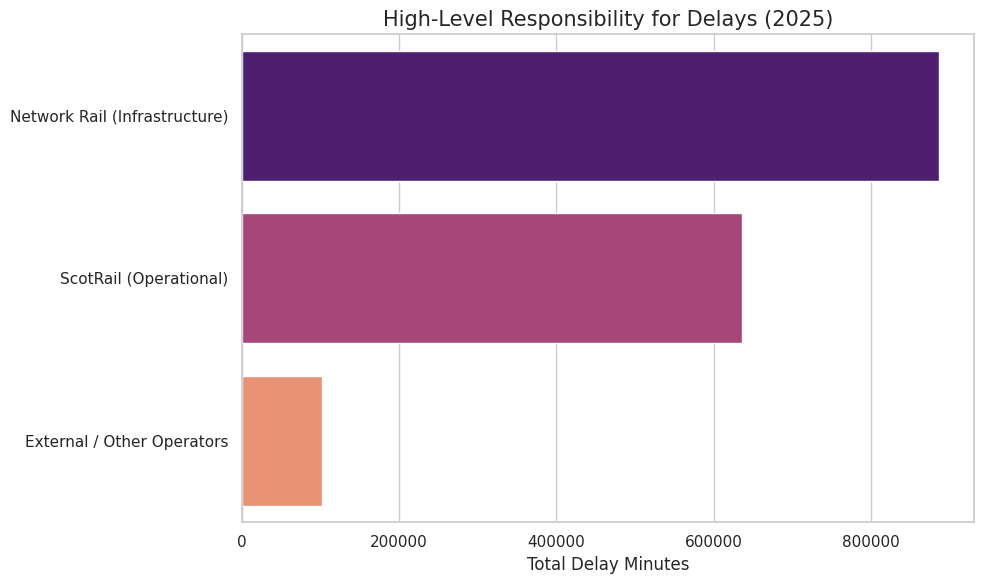
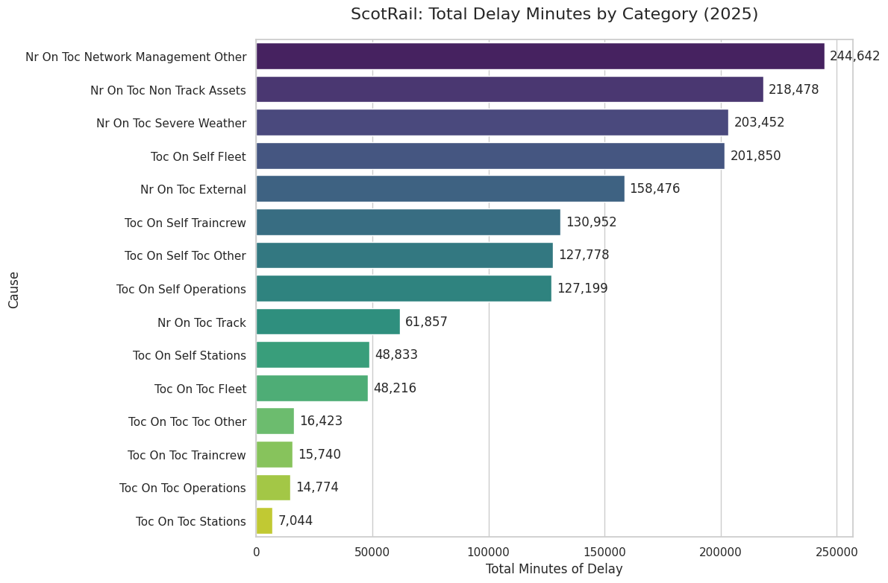
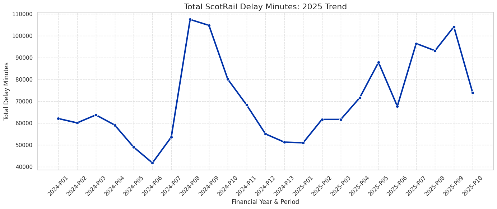

# 🚆 ScotRail Delay Attribution & Revenue Protection Analysis

## 📌 The Business Problem
In the UK rail network, punctuality is tied directly to revenue. Train operating companies (TOCs) face severe financial penalties and franchise risks for delays. However, not all delays are the operator's fault; many are caused by infrastructure failures managed by Network Rail. 

The objective of this project was to untangle messy Office of Rail and Road (ORR) delay data to determine the true root causes of ScotRail service disruptions, separate controllable vs. uncontrollable delays, and identify areas for operational intervention to protect brand equity and revenue.

## 🛠️ Tools & Techniques
* **Data Wrangling:** Python (Pandas), unpivoting complex matrixed datasets to create flat, relational tables.
* **Exploratory Data Analysis (EDA):** Time-series analysis, categorization grouping, and fault-attribution logic.
* **Data Visualization:** Matplotlib & Seaborn (exported for stakeholder reporting).

## 💡 Key Analytical Outcomes & Visual Insights

### 1. The True Cost of Infrastructure (Responsibility Breakdown)
By isolating delays by the responsible party, the data reveals a critical narrative: ScotRail absorbs significant public frustration for delays that are fundamentally outside of their operational control. 

*Figure 1: Proportion of delay minutes attributed to ScotRail (Controllable) vs. Network Rail/External (Uncontrollable).*

### 2. Identifying Controllable Bottlenecks (Delay by Category)
When drilling down into specific delay categories, clear patterns emerge. While infrastructure issues dominate the macro-level, specific operational categories (like train crew shortages or fleet maintenance) represent the largest *controllable* losses.

*Figure 2: Root cause analysis of delay minutes across all operational and infrastructure categories.*

### 3. Tracking Systemic Performance (Trend Timeline)
Analyzing the delay minutes across time highlights seasonal vulnerabilities and tracks whether operational interventions are actually improving service reliability month-over-month.

*Figure 3: Time-series analysis tracking delay volatility over the reporting period.*

## 🎯 Business Recommendations
Based on the data, I recommend a two-pronged operational strategy for ScotRail leadership:
1. **Aggressive Dispute Protocols (External):** A significant portion of delays are incorrectly defaulted or attributed to operations. ScotRail's commercial team must leverage this granular data to aggressively dispute delays bordering on Network Rail infrastructure boundaries to avoid unfair financial penalties.
2. **Targeted Crew Resourcing (Internal):** Rather than blanket investments in operations, HR and Operations must specifically target the highest-contributing controllable category (e.g., Crew Availability). Implementing predictive standby scheduling during peak disruption seasons (identified in the trend timeline) will yield the highest ROI on delay reduction.

## 📂 Project Structure
* `scotrail_delay_analysis.ipynb`: The core Jupyter Notebook containing the data cleaning (unpivoting), transformation logic, and visualization code.
* `assets/`: Contains the exported visual insights used for stakeholder reporting.
